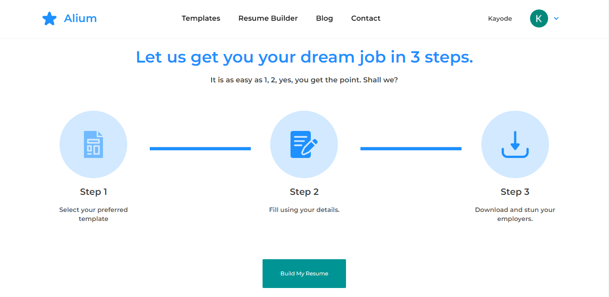
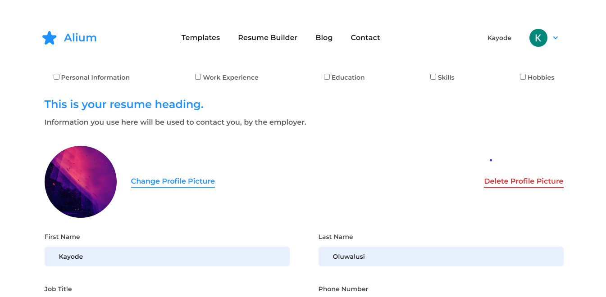
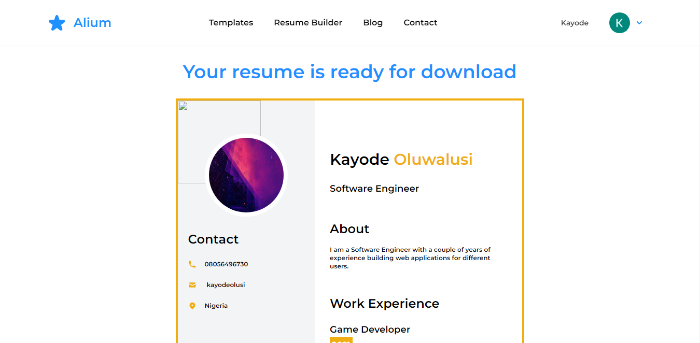

# Alium : Resume Builder

## Overview

Alium is an application that allows users to create resume templates

**Live-Link**: [https://alium.web.app](https://alium.web.app/)

## Tools Used

**Interface and Styling**

- React Js
- Redux
- Typescript
- Tailwind CSS
- Framer Motion

**Data and Authentication**

- Firebase
- Faker Js
- [https://resume-builder-ng.herokuapp.com](https://resume-builder-ng.herokuapp.com)

## Screenshots of the Application

